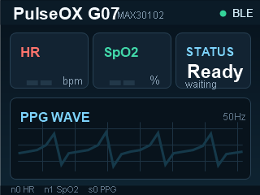

# PulseOX

基于 **ESP32 + MAX30102 + BLE + 微信小程序 + 淘晶驰串口屏** 的便携式血氧/心率监测项目。

项目可以读取 MAX30102 红光/红外 PPG 数据，计算心率和血氧饱和度，并同时显示在：

- 淘晶驰 USART HMI 串口屏
- 微信小程序 BLE 页面

> 说明：本项目用于课程实践、嵌入式学习和原型验证，不作为医疗诊断设备使用。

## 效果预览

### 串口屏界面



### 系统组成

```text
MAX30102  ->  ESP32  ->  串口屏显示
                    ->  BLE  ->  微信小程序显示
```

## 功能

- MAX30102 红光/红外数据采集
- PPG 波形滤波与心跳检测
- 心率 BPM 计算
- SpO2 血氧估算
- ESP32 BLE GATT 服务
- 微信小程序实时连接与显示
- 淘晶驰串口屏实时波形、心率、血氧显示
- 已整理 Arduino 依赖库，方便复刻

## 目录结构

```text
PulseOX/
  Arduino/
    MyPulseoximeterSpO2_1/
      MyPulseoximeterSpO2_1.ino
      filters.h

  Libraries/
    MAX3010x_Sensor_Library/
    NimBLE-Arduino/
    README.md

  WechatMiniProgram/
    miniprogram/
    typings/
    package.json
    project.config.json

  SerialScreen/
    TJC3224T110_011R_A01/
      w1.HMI
      yh_32.zi
      tjc_3224_pulseox_background.bmp
      tjc_3224_pulseox_background.png
      tjc_3224_ui_setup.md

    Reference_480x272/
      480x272 参考界面资源

  Docs/
    student_group_setup_guide.md
```

## 硬件清单

| 模块 | 说明 |
| --- | --- |
| ESP32 开发板 | 主控，负责采集、计算、BLE 通信和串口屏输出 |
| MAX30102 | 心率/血氧传感器 |
| 淘晶驰 TJC3224T110_011R_A01 | 320x240 USART HMI 串口屏 |
| USB 转串口模块 | 用于下载串口屏工程 |
| 杜邦线、电源线 | 模块连接 |

## 接线

### MAX30102

当前 Arduino 工程中 MAX30102 使用：

| MAX30102 | ESP32 |
| --- | --- |
| SDA | GPIO3 / RX |
| SCL | GPIO1 / TX |
| GND | GND |
| VCC | 3.3V 或模块支持电源 |

注意：GPIO1/GPIO3 通常也是 ESP32 的 USB 串口脚。如果 Arduino 烧录失败，可以先拔掉 MAX30102 的 SDA/SCL，烧录完成后再接回。

如需改回 ESP32 默认 I2C，可在 Arduino 程序中修改：

```cpp
const int kMax30102SdaPin = 21;
const int kMax30102SclPin = 22;
```

### 串口屏

当前 Arduino 工程中串口屏使用 `Serial2`：

| 串口屏 | ESP32 |
| --- | --- |
| TX | GPIO16 |
| RX | GPIO17 |
| GND | GND |
| VCC | 按屏幕要求供电 |

波特率：

```text
115200
```

## Arduino 依赖库

本仓库已经把需要的 Arduino 库整理到 `Libraries/` 中：

| 库 | 用途 |
| --- | --- |
| `MAX3010x_Sensor_Library` | 驱动 MAX30102，读取红光/红外原始数据 |
| `NimBLE-Arduino` | ESP32 BLE 蓝牙通信 |

复刻时，将下面两个文件夹复制到 Arduino 库目录：

```text
Libraries/MAX3010x_Sensor_Library
Libraries/NimBLE-Arduino
```

Windows 默认 Arduino 库目录通常是：

```text
C:\Users\你的用户名\Documents\Arduino\libraries\
```

复制完成后重启 Arduino IDE。

更详细的说明见：

[Libraries/README.md](Libraries/README.md)

## BLE 参数

当前工程使用 G07 配置：

| 项目 | 值 |
| --- | --- |
| BLE 设备名 | `ESP32-PulseOX-G07` |
| Service UUID | `7D6E0701-4F4F-4D50-8A43-4F58494D3032` |
| Wave Characteristic UUID | `7D6E0702-4F4F-4D50-8A43-4F58494D3032` |
| Metrics Characteristic UUID | `7D6E0703-4F4F-4D50-8A43-4F58494D3032` |

Arduino 和微信小程序中的设备名、Service UUID、Characteristic UUID 必须保持一致。

## 串口屏控件约定

USART HMI 工程中必须保留这三个控件名：

| 控件名 | 类型 | 用途 |
| --- | --- | --- |
| `n0` | 数字控件 | 心率 BPM |
| `n1` | 数字控件 | 血氧 SpO2 |
| `s0` | 曲线/波形控件 | PPG 波形 |

Arduino 程序通过下面指令更新串口屏：

```cpp
Serial2.print("add s0.id,0," + String(display_val) + "\xff\xff\xff");
Serial2.print("n0.val=" + String(latestAverageBpm) + "\xff\xff\xff");
Serial2.print("n1.val=" + String(latestAverageSpo2) + "\xff\xff\xff");
```

串口屏工程位置：

[SerialScreen/TJC3224T110_011R_A01/w1.HMI](SerialScreen/TJC3224T110_011R_A01/w1.HMI)

## 快速开始

### 1. 烧录 ESP32

1. 打开 Arduino IDE。
2. 安装 ESP32 开发板支持。
3. 复制 `Libraries/` 中的两个库到 Arduino `libraries` 目录。
4. 打开：

```text
Arduino/MyPulseoximeterSpO2_1/MyPulseoximeterSpO2_1.ino
```

5. 选择你的 ESP32 板卡和端口。
6. 编译并烧录。

### 2. 下载串口屏工程

1. 打开 USART HMI 编辑器。
2. 打开：

```text
SerialScreen/TJC3224T110_011R_A01/w1.HMI
```

3. 确认工程型号为 `TJC3224T110_011R_A01`。
4. 使用 USB 转串口连接屏幕。
5. 波特率选择 `115200`，若失败可尝试 `9600`。
6. 点击“联机并开始下载”。

下载时建议只连接屏幕和 USB 转串口，先不要同时接 ESP32。

### 3. 运行微信小程序

1. 打开微信开发者工具。
2. 导入：

```text
WechatMiniProgram/
```

3. 确认 `miniprogram/pages/index/index.ts` 中的 BLE 参数与 Arduino 一致。
4. 使用真机预览或真机调试。
5. 手机打开蓝牙，Android 还需要打开定位权限。
6. 连接 `ESP32-PulseOX-G07`。

## 数据协议

### 波形数据包

Characteristic：Wave UUID

| 字节 | 含义 |
| --- | --- |
| 0 | 包类型，固定 `0x01` |
| 1 | 波形序号 |
| 2 | 波形值，范围 `0-120` |
| 3 | 标志位，bit0 表示是否检测到手指 |

### 心率/血氧数据包

Characteristic：Metrics UUID

| 字节 | 含义 |
| --- | --- |
| 0 | 包类型，固定 `0x02` |
| 1-2 | 心率 BPM，小端序 uint16 |
| 3 | SpO2，范围 `0-100` |
| 4 | 标志位，bit0 为手指检测，bit1 为指标有效 |
| 5 | 当前波形序号 |

## 常见问题

### Arduino 编译提示 `MAX3010x.h` 找不到

说明没有安装 MAX30102 库。把：

```text
Libraries/MAX3010x_Sensor_Library
```

复制到 Arduino `libraries` 目录，然后重启 Arduino IDE。

### Arduino 编译提示 `NimBLEDevice.h` 找不到

说明没有安装 BLE 库。把：

```text
Libraries/NimBLE-Arduino
```

复制到 Arduino `libraries` 目录，然后重启 Arduino IDE。

### 串口屏有界面，但数字不变化

检查：

- 屏幕工程中的控件名是否为 `n0`、`n1`、`s0`
- 屏幕波特率是否为 `115200`
- 屏幕 TX/RX 是否与 ESP32 交叉连接
- ESP32 是否已经计算出有效心率和血氧

### 小程序能连接设备，但找不到服务

通常是 Service UUID 不一致。检查 Arduino 和小程序里的：

```text
Service UUID
Wave UUID
Metrics UUID
```

大小写不影响 BLE 本身，但小程序字符串比较时建议统一使用大写。

### 刚放上手指时心率/血氧一直是 `--`

这是正常现象。算法需要等待几次有效心跳后才会输出稳定值。手指轻轻覆盖传感器，不要按得太紧。

## 复刻建议

- 第一次测试时只打开一块 ESP32，避免多个同名 BLE 设备干扰。
- 如果多人小组同时使用，请为每组修改唯一设备名和 UUID。
- 串口屏 UI 修改后，务必保留 `n0`、`n1`、`s0` 控件名。
- 如果使用 GPIO1/GPIO3 连接 MAX30102，烧录 ESP32 失败时先拔掉传感器 I2C 线。

## 许可证

本项目用于课程实践和学习交流。上传 GitHub 前可根据需要补充正式开源许可证，例如 MIT License。

